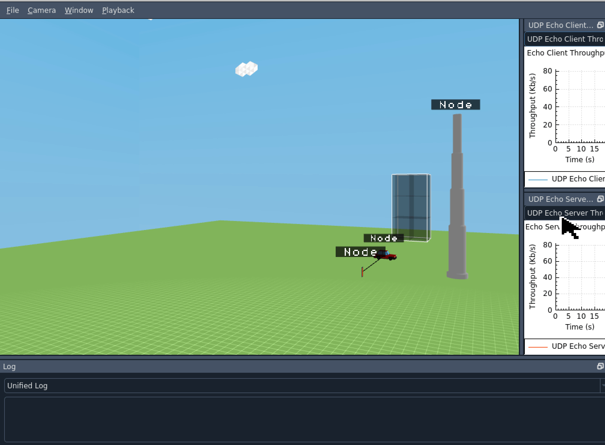
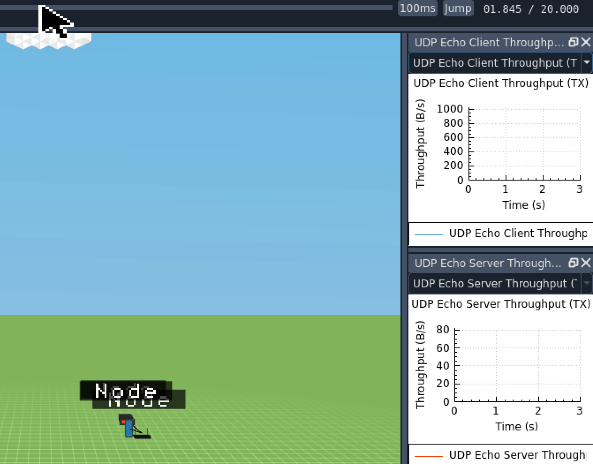

       
# 1. <mark>car-laptop-pole-circular-mobility.cc</mark>

### <ins>Description</ins>: *This scenario consists of four nodes:  CAR_VALUE, QUADCOPTER_UAV_VALUE, CELL_TOWER_POLE_VALUE and CELL_TOWER_VALUE. Using the waypoint mobility model, the car and quadcopter rotate around the cell tower pole which is inside the cell tower. The graph (UDP Echo Client Throughput) shows the communication (time vs bytes/sec).*

---

# 2. <mark>car-quadcopter-circular-mobility.cc</mark>

### <ins>Description</ins>: *TWO*

---

# 3. <mark>car-quadcopter-different-speeds-circular-mobility.cc</mark>

### <ins>Description</ins>: *THREE*

---

# 4. <mark>car-quadcopter-pole-straight-mobility.cc</mark>

### <ins>Description</ins>: *FOUR*

---

# 5. <mark>four-node-client.cc</mark>

### <ins>Description</ins>: *FIVE*

---

# 6. <mark>smartphone-car-constant-connectivity-with-building.cc</mark>

### <ins>Description</ins>: *SIX*

---

# 7. <mark>ten-cars-building-circular-mobility.cc</mark>

### <ins>Description</ins>: *SEVEN*

---

# 8. <mark>ten-cars-circular-mobility.cc</mark>

### <ins>Description</ins>: *NINE*

---

# 9. <mark>ten-node-circular-mobility.cc</mark>

### <ins>Description</ins>: *TEN*

---

# 10. <mark>three-car-constant-connectivity.cc</mark>

### <ins>Description</ins>: *ELEVEN*

---

# 11. <mark>three-node-car-tower-smartphone.cc</mark>

### <ins>Description</ins>: *TWELVE*

---

# 12. <mark>three-node-client.cc</mark>

### <ins>Description</ins>: *THIRTEEN*

---

# 13. <mark>three-node-mobility.cc</mark>

### <ins>Description</ins>: *FOURTEEN*

---

# 14. <mark>three-node-random-walk.cc</mark>

### <ins>Description</ins>: *FIFTEEN*

---

# 15. <mark>two-car-building-server-connection-dip.cc</mark>

### <ins>Description</ins>: *SIXTEEN*

---

# 16. <mark>two-car-constant-connectivity-through-distance.cc</mark>

### <ins>Description</ins>: *SEVENTEEN*

---

# 17. <mark>two-car-constant-connectivity-through-motion.cc</mark>

### <ins>Description</ins>: *EIGHTEEN*

---

# 18. <mark>two-car-obstacle-server-connection-dip.cc</mark>

### <ins>Description</ins>: *NINETEEN*

---

# 19. <mark>two-car-obstacle-server-connection-lost.cc</mark>

### <ins>Description</ins>: *TWENTY*

---

# 20. <mark>two-car-straight-mobility-client-server.cc</mark>

### <ins>Description</ins>: *TWENTY ONE*

---

# 21. <mark>two-node-client-server-connectivity.cc</mark>

### <ins>Description</ins>: *TWENTY TWO*

---

# 22. <mark>two-node-straight-mobility.cc</mark>

### <ins>Description</ins>: *TWENTY THREE*

---

