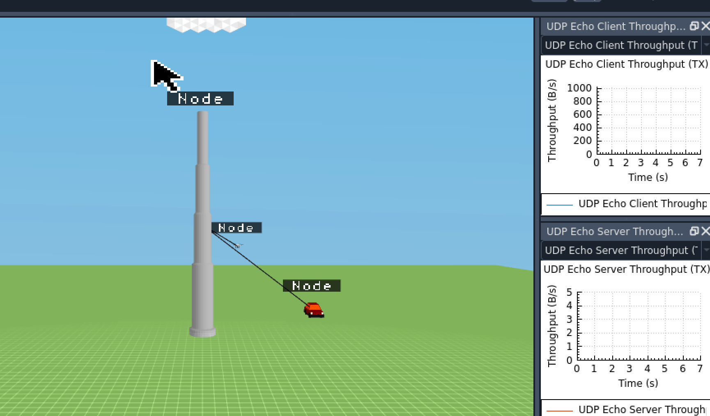
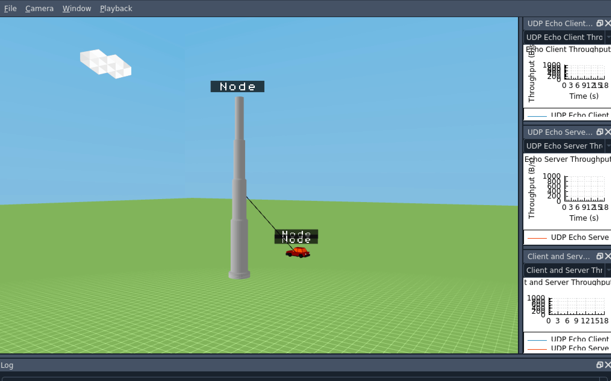
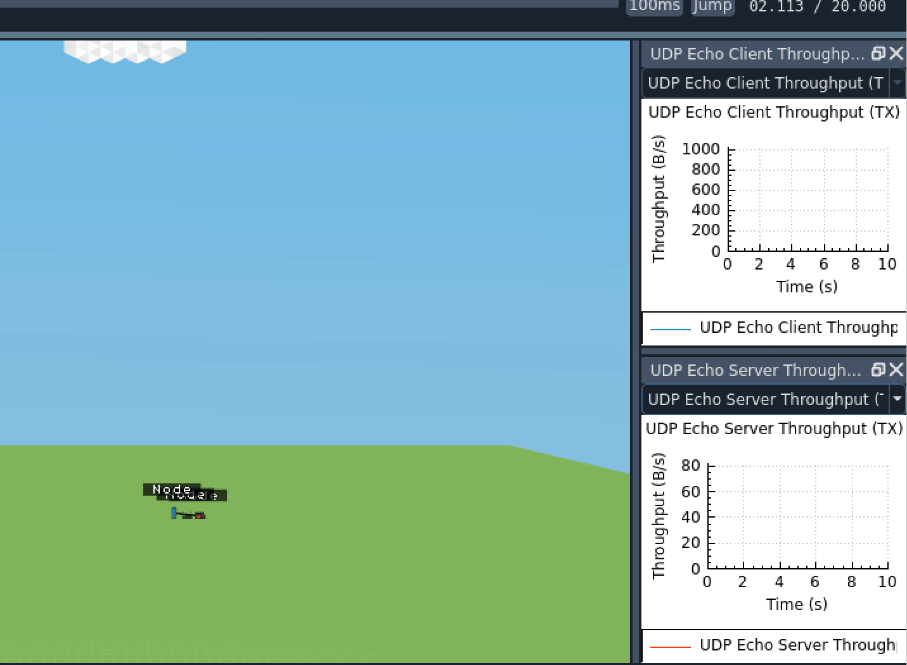
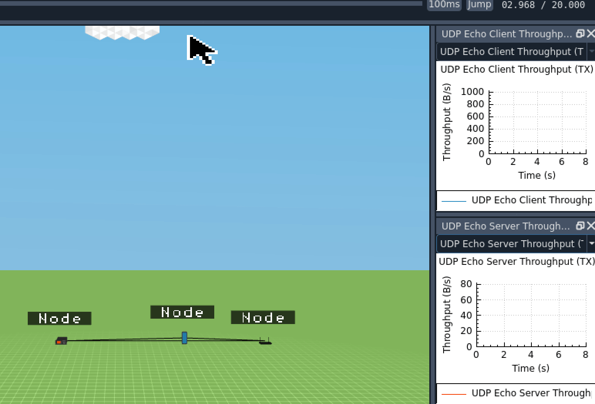

  
# 1. <mark>car-laptop-pole-circular-mobility.cc</mark>

### <ins>Description</ins>: *This scenario consists of three nodes: CAR_VALUE, LAPTOP_VALUE, CELL_TOWER_POLE_VALUE. Using the waypoint mobility model, the car and laptop rotate around the cell tower pole. The graph (UDP Echo Client Throughput) shows the communication (time vs bytes/sec).*

---

# 2. <mark>car-quadcopter-circular-mobility.cc</mark>

### <ins>Description</ins>: *This scenario consists of three nodes: CAR_VALUE, QUADCOPTER_UAV_VALUE, CELL_TOWER_POLE_VALUE. Using the waypoint mobility model, the car and quadcopter rotate around the cell tower pole at the same speed. The graph (UDP Echo Client Throughput) shows the communication (time vs bytes/sec).*

---

# 3. <mark>car-quadcopter-different-speeds-circular-mobility.cc</mark>

### <ins>Description</ins>: *This scenario consists of three nodes: CAR_VALUE, QUADCOPTER_UAV_VALUE, CELL_TOWER_POLE_VALUE. Using the waypoint mobility model, the car and quadcopter rotate around the cell tower pole at different speeds. The graph (UDP Echo Client Throughput) shows the communication (time vs bytes/sec).*

---

# 4. <mark>car-quadcopter-pole-straight-mobility.cc</mark>

### <ins>Description</ins>: *This scenario consists of three nodes: CAR_VALUE, QUADCOPTER_UAV_VALUE, CELL_TOWER_POLE_VALUE. Using the constant velocity mobility model, the car and quadcopter rotate (both on the ground) around the cell tower pole in opposite directions. The graph (UDP Echo Client Throughput) shows the communication (time vs bytes/sec).*

---

# 5. <mark>four-node-client.cc</mark>

### <ins>Description</ins>: *This scenario consists of four nodes: SERVER_VALUE, ROUTER_VALUE, SMARTPHONE_VALUE, CELL_TOWER_POLE_VALUE. The graph (UDP Echo Client Throughput) shows the communication (time vs bytes/sec).*

---

# 6. <mark>smartphone-car-constant-connectivity-with-building.cc</mark>

### <ins>Description</ins>: *This scenario consists of three nodes: CAR_VALUE, SMARTPHONE_VALUE, CELL_TOWER_POLE_VALUE. Using the constant velocity mobility model, the goes in a straight line away from the cell tower pole with no impact on communication. The graphs (UDP Echo Client & Server Throughput) show the communication (time vs bytes/sec).*

---

# 7. <mark>ten-cars-building-circular-mobility.cc</mark>

### <ins>Description</ins>: *This scenario consists of multiple nodes: CAR_VALUE, BUILDING. Using the constant velocity mobility model, ten cars go in a circular path around the building with no impact on communication. The graph (UDP Echo Client Throughput) shows the communication (time vs bytes/sec).*

---

# 8. <mark>ten-cars-circular-mobility.cc</mark>

### <ins>Description</ins>: *This scenario consists of multiple nodes: CAR_VALUE, CELL_TOWER_POLE_VALUE. Using the constant velocity mobility model, ten cars go in a circular path around the cell tower pole with no impact on communication. The graph (UDP Echo Client Throughput) shows the communication (time vs bytes/sec).*

---

# 9. <mark>ten-node-circular-mobility.cc</mark>

### <ins>Description</ins>: *This scenario consists of multiple nodes. Using the constant velocity mobility model, ten nodes go in a circular path around the stationary node with no impact on communication. The graph (UDP Echo Client Throughput) shows the communication (time vs bytes/sec).*

---

# 10. <mark>three-car-constant-connectivity.cc</mark>

### <ins>Description</ins>: *This scenario consists of three nodes each a CAR_VALUE. Using the constant velocity mobility model, two cars move at a constant speed on wither side of a stationary car keeping communication between all cars consistent. The graphs (UDP Echo Client & Server Throughput) show the communication (time vs bytes/sec).*

---

# 11. <mark>three-node-car-tower-smartphone.cc</mark>

### <ins>Description</ins>: *This scenario consists of three nodes: CAR_VALUE, CELL_TOWER_VALUE, SMARTPHONE_VALUE. Using the constant velocity mobility model, the car moves at a constant speed away from the tower keeping communication. The graphs (UDP Echo Client & Server Throughput) show the communication (time vs bytes/sec).*

---

# 12. <mark>three-node-client.cc</mark>

### <ins>Description</ins>: *This scenario consists of three nodes: SERVER_VALUE, ROUTER_VALUE, SMARTPHONE_VALUE. The graph (UDP Echo Client Throughput) shows the communication (time vs bytes/sec).*

---

# 13. <mark>three-node-mobility.cc</mark>

### <ins>Description</ins>: *This scenario consists of three nodes: SERVER_VALUE, ROUTER_VALUE, SMARTPHONE_VALUE. Using the constant velocity mobility model, the three nodesmove in a straight line. The graph (UDP Echo Client Throughput) shows the communication (time vs bytes/sec).*

---

# 14. <mark>three-node-random-walk.cc</mark>

### <ins>Description</ins>: *This scenario consists of three nodes: SERVER_VALUE, ROUTER_VALUE, SMARTPHONE_VALUE. Using the random walk mobility model, the three nodesmove in a straight line. The graph (UDP Echo Client Throughput) shows the communication (time vs bytes/sec).*

---

# 15. <mark>two-car-building-server-connection-dip.cc</mark>

### <ins>Description</ins>: *This scenario consists of two nodes each a CAR_VALUE. Using the constant velocity mobility model, the cars move at a constant speed on either side of the building keeping communication. There is a communication dip during the time the building acts as an obstacle. The graphs (UDP Echo Client & Server Throughput) show the communication (time vs bytes/sec).*

---

# 16. <mark>two-car-constant-connectivity-through-distance.cc</mark>

### <ins>Description</ins>: *This scenario consists of two nodes each a CAR_VALUE. Using the constant velocity mobility model, the cars move at a constant speed away from each other keeping communication. The graphs (UDP Echo Client & Server Throughput) show the communication (time vs bytes/sec).*

---

# 17. <mark>two-car-constant-connectivity-through-motion.cc</mark>

### <ins>Description</ins>: *This scenario consists of two nodes each a CAR_VALUE. Using the constant velocity mobility model, the cars move at a constant speed together keeping communication. The graphs (UDP Echo Client & Server Throughput) show the communication (time vs bytes/sec).*

---

# 18. <mark>two-car-obstacle-server-connection-dip.cc</mark>

### <ins>Description</ins>: *This scenario consists of two nodes each a CAR_VALUE. Using the constant velocity mobility model, the cars move at a constant speed together keeping communication till they pass the stationary car. The graphs (UDP Echo Client & Server Throughput) show the communication (time vs bytes/sec).*

---

# 19. <mark>two-car-obstacle-server-connection-lost.cc</mark>

### <ins>Description</ins>: *This scenario consists of three nodes each a CAR_VALUE. Using the constant velocity mobility model, one of the cars moves at a constant speed together keeping communication till the third car passes in between interrupting the client-server communication. The graphs (UDP Echo Client & Server Throughput) show the communication (time vs bytes/sec).*

---

# 20. <mark>two-car-straight-mobility-client-server.cc</mark>

### <ins>Description</ins>: *This scenario consists of two nodes each a CAR_VALUE. Using the constant velocity mobility model, the cars move at a constant speed away from each other keeping communication. The graphs (UDP Echo Client & Server Throughput) show the communication (time vs bytes/sec).*

---

# 21. <mark>two-node-client-server-connectivity.cc</mark>

### <ins>Description</ins>: *This scenario consists of two nodes: SERVER_VALUE, SMARTPHONE_VALUE. The graphs (UDP Echo Client & Server Throughput) show the communication (time vs bytes/sec).*

---

# 22. <mark>two-node-straight-mobility.cc</mark>

### <ins>Description</ins>: *This scenario consists of two nodes: SERVER_VALUE, SMARTPHONE_VALUE. Using the constant velocity mobility model, the nodes move constantly. The graph (UDP Echo Client Throughput) shows the communication (time vs bytes/sec).*

---

