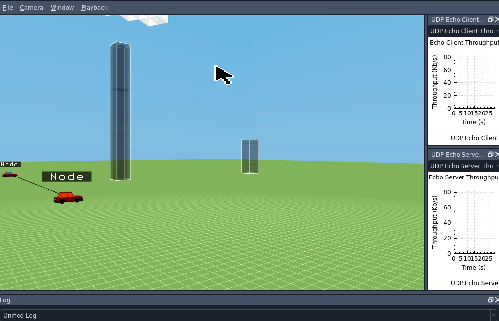
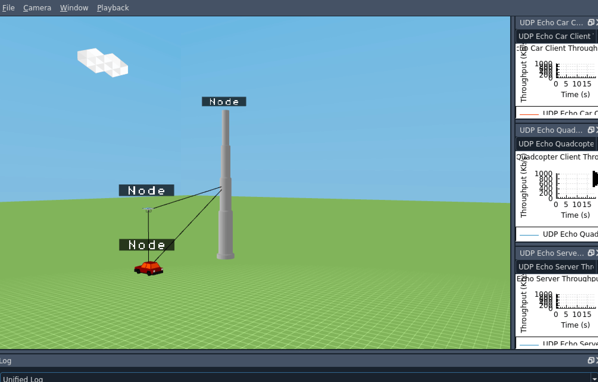

---

- #### __The base folder is__ *<ins>rkotans3/ns-3.38</ins>*
- #### __The example folder is__ *<ins>rkotans3/ns-3.38/myexamples_cc</ins>*
- #### __The json folder is__ *<ins>rkotans3/ns-3.38/myexamples_json</ins>*
- #### __The gif folder is__ *<ins>rkotans3/ns-3.38/myexamples_gif</ins>*

---

# 1. <mark>car-quadcopter-pole-straight-mobility.cc</mark>

### <ins>Description</ins>: *This scenario consists of three nodes: CAR_VALUE, QUADCOPTER_UAV_VALUE, CELL_TOWER_POLE_VALUE. Using the constant velocity mobility model, the car and quadcopter move in opposite directions. The graph (UDP Echo Client Throughput) shows the communication of the client which is the car. The graph (UDP Echo Server Throughput) shows the communication of the server which is the quadcopter. The connectivity cuts off as the distance becomes too far.*

---

# 2. <mark>four-node-client.cc</mark>

### <ins>Description</ins>: *This scenario consists of four nodes: SERVER_VALUE, ROUTER_VALUE, SMARTPHONE_VALUE, CELL_TOWER_POLE_VALUE. The graph (UDP Echo Client Throughput) shows the communication (time vs bytes/sec).*

---

# 3. <mark>smartphone-car-constant-connectivity-with-building.cc</mark>

### <ins>Description</ins>: *This scenario consists of three nodes: CAR_VALUE, SMARTPHONE_VALUE, CELL_TOWER_POLE_VALUE. Using the constant velocity mobility model, the goes in a straight line away from the cell tower pole with no impact on communication. The graphs (UDP Echo Client & Server Throughput) show the communication (time vs bytes/sec).*

---

# 4. <mark>ten-cars-building-circular-mobility.cc</mark>

### <ins>Description</ins>: *This scenario consists of multiple nodes: CAR_VALUE, BUILDING. Using the constant velocity mobility model, ten cars go in a circular path around the building with no impact on communication. The graph (UDP Echo Client Throughput) shows the communication (time vs bytes/sec).*

---

# 5. <mark>ten-cars-circular-mobility.cc</mark>

### <ins>Description</ins>: *This scenario consists of multiple nodes: CAR_VALUE, CELL_TOWER_POLE_VALUE. Using the constant velocity mobility model, ten cars go in a circular path around the cell tower pole with no impact on communication. The graph (UDP Echo Client Throughput) shows the communication (time vs bytes/sec).*

---

# 6. <mark>ten-node-circular-mobility.cc</mark>

### <ins>Description</ins>: *This scenario consists of multiple nodes. Using the constant velocity mobility model, eight nodes go in a circular path around the stationary node. Another stationary node is next to the node that is central to the circular path. As the nodes in the circular path move closer to the second stationary node, the connectivity increases, but goes down as they go further away. The graph (UDP Echo Client Throughput) shows the communication (time vs bytes/sec).*

---

# 7. <mark>three-car-constant-connectivity.cc</mark>

### <ins>Description</ins>: *This scenario consists of three nodes each a CAR_VALUE. Using the constant velocity mobility model, two cars move at a constant speed on wither side of a stationary car keeping communication between all cars consistent. The graphs (UDP Echo Client & Server Throughput) show the communication (time vs bytes/sec).*

---

# 8. <mark>three-node-car-tower-smartphone.cc</mark>

### <ins>Description</ins>: *This scenario consists of three nodes: CAR_VALUE, CELL_TOWER_VALUE, SMARTPHONE_VALUE. Using the constant velocity mobility model, the car moves at a constant speed away from the tower. The graph (UDP Echo Client Throughput) show the communication of the smartphone client with the cell tower, and the graph (UDP Echo Server Throughput) shows the communication of the cell tower server with the smartphone client.*

---

# 9. <mark>three-node-mobility.cc</mark>

### <ins>Description</ins>: *This scenario consists of three nodes: SERVER_VALUE, ROUTER_VALUE, SMARTPHONE_VALUE. Using the constant velocity mobility model, the three nodes move in a straight line. The graph (UDP Echo Client Throughput) shows the communication (time vs bytes/sec) of the smartphone with the server which cuts off after the distance is too far. The server communication is not there as the server is too far away from the router.*

---

# 10. <mark>two-car-building-server-connection-dip.cc</mark>

### <ins>Description</ins>: *This scenario consists of two nodes each a CAR_VALUE. Using the constant velocity mobility model, the cars move at a constant speed on either side of the building keeping communication. There is a communication dip during the time the building acts as an obstacle. The graphs (UDP Echo Client & Server Throughput) show the communication (time vs bytes/sec).*

---

# 11. <mark>two-car-constant-connectivity-through-motion.cc</mark>

### <ins>Description</ins>: *This scenario consists of two nodes each a CAR_VALUE, one client and one server. Using the constant velocity mobility model, the cars move at a constant speed together keeping communication. The graphs (UDP Echo Client & Server Throughput) show the communication (time vs bytes/sec).
*

---

# 12. <mark>two-car-obstacle-server-connection-dip.cc</mark>

### <ins>Description</ins>: *This scenario consists of two nodes each a CAR_VALUE. Using the constant velocity mobility model, the cars move at a constant speed together keeping communication till they pass the stationary car. The graphs (UDP Echo Client & Server Throughput) show the communication (time vs bytes/sec).*

---

# 13. <mark>two-car-obstacle-server-connection-lost.cc</mark>

### <ins>Description</ins>: *This scenario consists of three nodes each a CAR_VALUE. Using the constant velocity mobility model, one of the cars moves at a constant speed together keeping communication till the third car passes in between interrupting the client-server communication. The graphs (UDP Echo Client & Server Throughput) show the communication (time vs bytes/sec).*

---

# 14. <mark>two-car-building-proper-connection-dip.cc</mark>

### <ins>Description</ins>: *This scenario consists of two nodes each CAR_VALUE. Using the constant velocity mobility model, the nodes move at a constant speed. The UDP Echo Client Throughput graph shows the communication of the car on the left and the UDP Echo Server Throughput graph shows the communication of the car on the right. As the cars approach the building, the connectivity slightly dips and then goes back up once they pass the building.*

---

# 15. <mark>two-car-double-building-connectivity.cc</mark>

### <ins>Description</ins>: *This scenario consists of two nodes each CAR_VALUE. Using the constant velocity mobility model, the nodes move at a constant speed. The UDP Echo Client Throughput graph shows the communication of the car on the left and the UDP Echo Server Throughput graph shows the communication of the car on the right. As the cars approach the building, the connectivity gets completely cut and then goes back up once they pass the building. The same repeats for the second building.*

---

# 16. <mark>two-car-fifteen-building-connectivity.cc</mark>

### <ins>Description</ins>: *This scenario consists of two nodes each CAR_VALUE. Using the constant velocity mobility model, the nodes move at a constant speed. The UDP Echo Client Throughput graph shows the communication of the car on the left and the UDP Echo Server Throughput graph shows the communication of the car on the right. As the cars approach the buildings, the connectivity gets completely cut and then goes back up once they pass the building. The same repeats for each of the fifteen buildings.*

---

# 17. <mark>two-car-uav-fifteen-building-connectivity.cc</mark>

### <ins>Description</ins>: *This scenario consists of three nodes, two CAR_VALUE and one QUADCOPTER_UAV_VALUE. Using the constant velocity mobility model, the nodes move at a constant speed. There are three graphs. The UDP Echo Car1 Client Throughput (RX) graph shows the connectivity between the first car and the UAV. The UDP Echo Car2 Client Throughput (RX) graph shows the connectivity between the second car and the UAV. The UDP Echo Server Throughput (RX) graph shows the server (UAV) communicating with both of the cars. The connectivity of each graph drops as the server encounters a building blocking its connectivity with both cars.*

---

# 18. <mark>car-quadcopter-circular-motion-connectivity.cc</mark>

### <ins>Description</ins>: *This scenario consists of three nodes: CAR_VALUE, QUADCOPTER_UAV_VALUE, CELL_TOWER_POLE_VALUE. Using the waypoint mobility model, the car and quadcopter rotate around the cell tower pole at the same speed. The Car Client graph shows the communication between the car and the cell tower pole, the Quadcopter Client graph shows the communication between the UAV and the cell tower pole. The server is the cell tower pole value which shows the communication of the cell tower pole with the clients.*

---

# 19. <mark>two-car-fifteen-buildings-uav.cc</mark>

### <ins>Description</ins>: *This scenario consists of three nodes, two CAR_VALUE and one QUADCOPTER_UAV_VALUE. Using the constant velocity mobility model, the nodes move at a constant speed. There are three graphs. The UDP Echo Car1 Client Throughput (RX) graph shows the connectivity between the first car and the UAV. The UDP Echo Car2 Client Throughput (RX) graph shows the connectivity between the second car and the UAV. The UDP Echo Server Throughput (RX) graph shows the server (UAV) communicating with both of the cars. The connectivity of each graph drops as the server encounters one of the fifteen different buildings blocking its connectivity with both cars.*

---

# 20. <mark>ten-car-fifteen-buildings-uav.cc</mark>

### <ins>Description</ins>: *This scenario consists of eleven nodes, ten CAR_VALUE and one QUADCOPTER_UAV_VALUE. Using the constant velocity mobility model, the nodes move at a constant speed. There are two graphs. The UDP Echo Client Throughput (RX) graph shows the average connectivity of each car. The UDP Echo Server Throughput (RX) graph shows the server’s average connectivity with each car (UAV). The connectivity of each graph drops as the server encounters one of the fifteen different buildings blocking its connectivity with each car.*

---

# 21. <mark>two-car-uav-traffic.cc</mark>

### <ins>Description</ins>: *This scenario consists of three nodes, two CAR_VALUE and one QUADCOPTER_UAV_VALUE. Using the constant velocity mobility model, the nodes move at a constant speed. There are three graphs. The UDP Echo Car1 Client Throughput (RX) graph shows the connectivity between the first car and the UAV as well as the connectivity between the first car and the second car. The UDP Echo Car2 Client Throughput (RX) graph shows the connectivity between the second car and the UAV as well as the connectivity between the second car and the first car. The UDP Echo Server Throughput (RX) graph shows the server (UAV) communicating with both of the cars. The connectivity of each car graph drops as the cars encounter one of the obstacles and the server connectivity drops when the UAV gets blocked by a building.*

---
